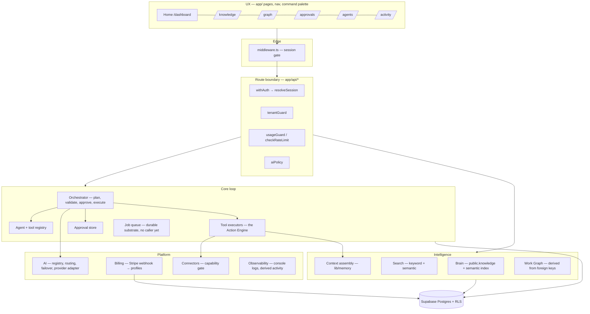
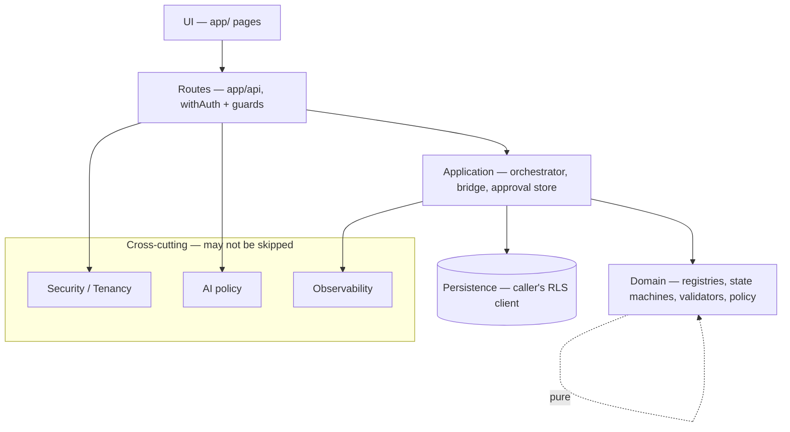
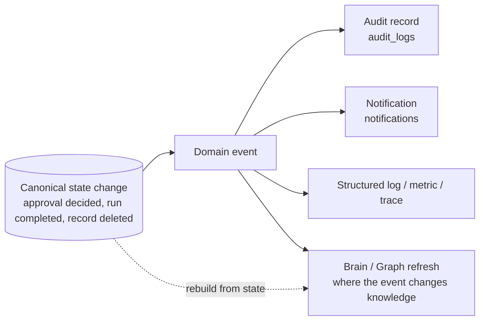
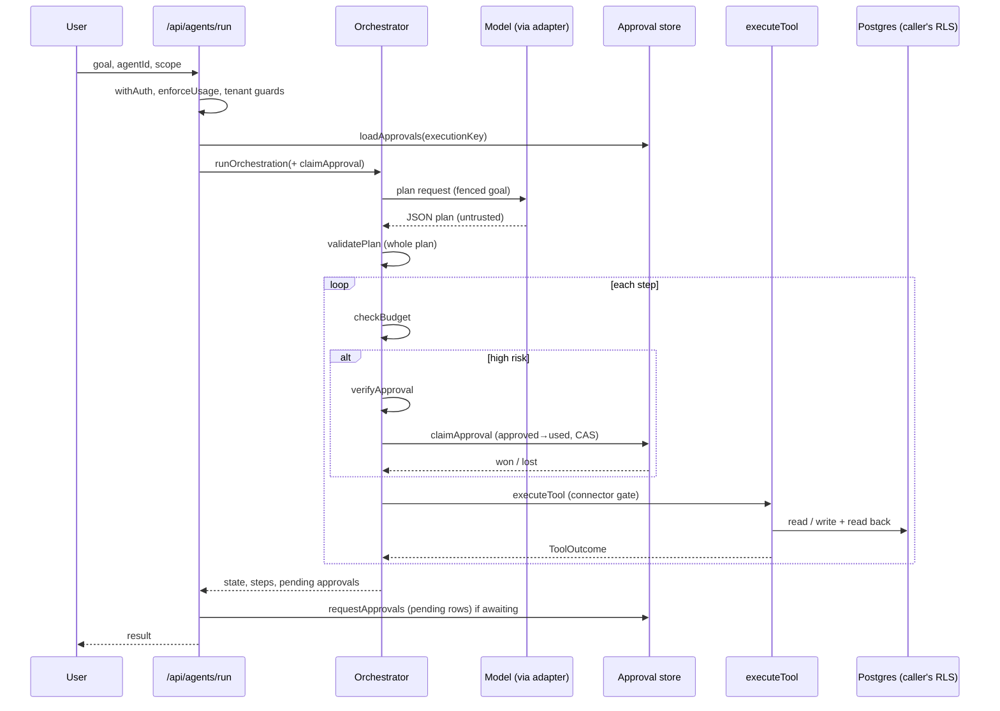
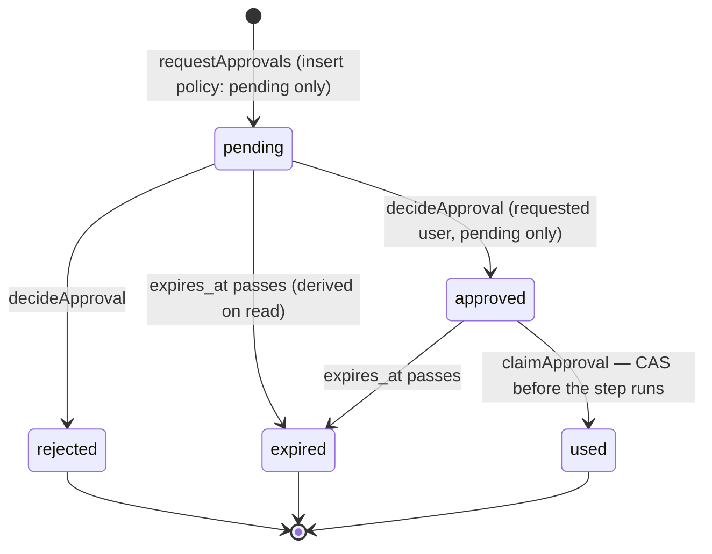
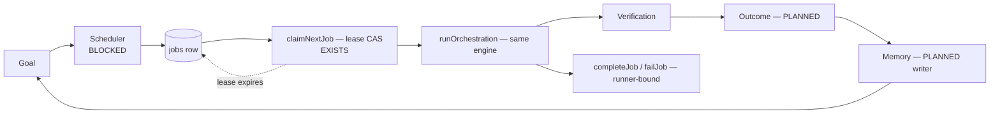
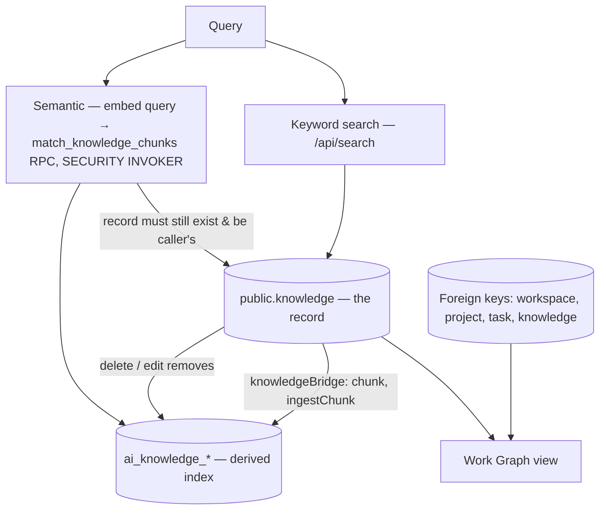
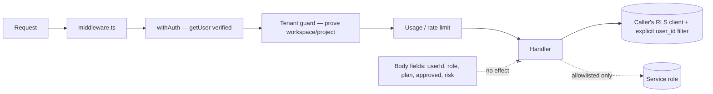
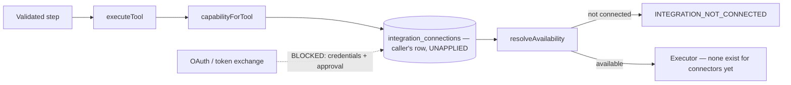

# SYRAVEN — North Star Architecture

**Phase 1.** Written 2026-09-13 from the repository as it stands, not
from earlier documents. Every status below was checked against code in
this phase; where an earlier document disagrees, this one is the current
reading and the disagreement is named.

**Second Phase 1 pass (2026-09-13).** A re-inspection and an adversarial
review of the **database** layer (not only route code) found that three
statements in the first pass were wrong and that several invariants held
in code while the database did not enforce them. Corrections are marked
**[corrected]** in place; new decisions are ADR-002 and ADR-003.

**Phase 1 status: PASS** (founder-accepted 2026-09-14). Not closed by it,
and recorded as limitations: I-7 and I-15 PARTIAL, I-14 BLOCKED (§12).

> Give SYRAVEN the goal. It runs the work.

**How to read the labels**

| Label | Meaning |
|---|---|
| **IMPLEMENTED** | Code exists, is reachable from the product, and is covered by tests |
| **PARTIAL** | Real, but a named part of the target is missing |
| **PLANNED** | Target defined here; no code yet |
| **BLOCKED** | Cannot proceed without something outside the code: an approval, a credential, an account |
| **DEAD** | Code with no importer — unreachable |
| **FAKE** | Reported work or state that did not happen (all known instances removed; see §9) |
| **DUPLICATED / INCONSISTENT** | Two authorities, or two implementations, for one concept |

Invariants referenced as **I-n** are the sixteen in §12, each checked by
`tests/security/architecture-invariants.test.ts`.

---

## 1. The North Star

SYRAVEN is one loop, surrounded by platform layers that every stage of the
loop uses and none may bypass.

```
GOAL → CONTEXT → BRAIN → PLAN → AGENTS → WORK GRAPH → ACTION ENGINE
     → APPROVAL → EXECUTION → VERIFICATION → OUTCOME → MEMORY → AUTOPILOT
```

**Platform layers:** Identity · Tenancy · Security · AI · Billing ·
Connectors · Search · Notifications · Observability · UX.

Three rules make it one system:

1. **One authority per concept** (§7). Two places that can each decide
   "is this approved" or "did this run" will eventually disagree.
2. **The model proposes; the server decides.** AI output is untrusted
   input everywhere: it never decides identity, tenancy, entitlement,
   approval, or execution state (§8).
3. **One execution substrate.** Chat, agents, tasks and Autopilot all act
   through the same Action Engine, the same approval, the same durable
   execution. A second executor is a second definition of "done".

### A. System architecture



### B. Core work loop — current status

```mermaid
flowchart LR
  G[GOAL<br/>PARTIAL: request text only] --> C[CONTEXT<br/>IMPLEMENTED: lib/memory]
  C --> B[BRAIN<br/>PARTIAL]
  B --> P[PLAN<br/>PARTIAL: not persisted]
  P --> A[AGENTS<br/>PARTIAL: two agent concepts]
  A --> W[WORK GRAPH<br/>PARTIAL: derived view]
  W --> AE[ACTION ENGINE<br/>PARTIAL]
  AE --> AP[APPROVAL<br/>IMPLEMENTED]
  AP --> EX[EXECUTION<br/>PARTIAL: request-scoped]
  EX --> V[VERIFICATION<br/>PARTIAL]
  V --> O[OUTCOME<br/>PLANNED]
  O --> M[MEMORY<br/>PARTIAL: read-only]
  M --> AU[AUTOPILOT<br/>BLOCKED]
  AU -.-> G
```



---

## 2. Current-state truth map

Status, entry points and problems for every subsystem, as found.

| Subsystem | Status | Current implementation & entry points | Data | Security boundary | Current problems |
|---|---|---|---|---|---|
| **Identity** | IMPLEMENTED | `lib/auth/session.ts` `resolveSession()` (verifies with `auth.getUser`, cookie or bearer); `withAuth()`; `middleware.ts` gate; `/api/auth/*` | Supabase Auth | Verified session only | Session carries no organization. Credential-verification failures were silent until this session (now logged, name/status only) |
| **Tenancy** | PARTIAL | `lib/auth/authorization.ts` (`authorizeWorkspace`, `authorizeProject`, org membership); `lib/api/tenantGuard.ts` | `organizations`, `organization_members`, `workspaces`, `teams` | RLS + explicit `user_id` filters | Most data is personal (`user_id`); organization is not part of the session. **[corrected]** `public.projects` **has** RLS (`20260901154222`, owner / org member / `visibility='public'`); its insert and update policies never checked `organization_id`, so a project could be planted in another organization — closed by `20260913130000` (**not applied**). `messages` insert admitted a row into another user's conversation (same migration). Intra-org: an org admin can take `owner_id` and promote members to `owner` (documented, §9) |
| **Security** | PARTIAL | RLS on most tables; service role only in allowlisted routes (`data-access.test.ts`); `rate_limit_events`; Stripe signature check | — | Deny by default in routes; **RLS is the only boundary for a direct PostgREST caller** (ADR-003) | `20260906120000` grants DML on every table to `authenticated`, so every client-writable column is reachable around the routes: billing state on `profiles` was (§9). Security headers are set in `next.config.ts` (Phase 1 step 7; `security-headers.test.ts`): framing refused (`frame-ancestors 'none'`, `X-Frame-Options: DENY`), `nosniff`, `Referrer-Policy`, `Permissions-Policy` (camera/microphone/geolocation denied), HSTS two years without `includeSubDomains`/`preload`. The CSP carries **no** `script-src`/`style-src`: inline code is unaudited and no browser run could verify a stricter policy. Drifted tables (`20260901165000`) may carry untracked production policies — a `pg_policies` read of production has **not** been done |
| **AI** | PARTIAL · DUPLICATED | `lib/ai/registry.ts` (7 models, openai + groq), `routing.ts`, `failover.ts`, `provider.ts`; `lib/api/aiPolicy.ts` | — | Registry + plan decide the model | Only `OPENAI_API_KEY` configured → failover cannot switch provider. **[corrected]** Five routes keep their own transport and an env-named default model: `chat`, `files/analyze`, `stream`, `voice/transcribe`, `voice/speak` (metered, key paired with its own provider; consolidation deferred — streaming and audio are not in the adapter). `canvas` used the OpenAI SDK with a model from `OPENAI_CANVAS_MODEL`, bypassing the registry and the plan's model entitlement — **moved onto `selectModel` + the adapter in Phase 1 step 7**; no route may import the SDK (I-3 guard). `lib/search/openaiEmbedding.ts` has its own call but takes key and endpoint from the registry. Each pairs a key with its own provider's endpoint. Adapter users: orchestrator, `agents/execute`, `presentations/generate` |
| **Brain** | PARTIAL | `public.knowledge` (`/api/knowledge`); semantic index `ai_knowledge_*` via `lib/search/knowledgeBridge.ts`; `/api/knowledge/index` | `knowledge`, `ai_knowledge_bases → sources → documents → chunks` | RLS on caller's client | Decisions, people, outcomes are not Brain objects yet |
| **Search** | PARTIAL · DUPLICATED | `/api/search` (`lib/search/query.ts`, keyword over projects/tasks/knowledge); `/api/knowledge/search` (keyword, knowledge only); `/api/knowledge/semantic` (vector) | — | RLS + explicit filters | **[corrected]** Two keyword *search endpoints*, plus five `ilike` list filters in resource routes (`tasks`, `projects`, `knowledge`, `agents`) and `lib/memory/retrieval.ts`. No hybrid or graph-aware retrieval. `retrieval.ts` builds its project set with no owner filter, so RLS admits other users' `public` projects into it; each knowledge row is re-checked afterwards |
| **Planning** | PARTIAL | `lib/orchestration/orchestrator.ts` asks the model for a JSON plan; `planValidation.ts` validates the **whole** plan | — | Plan is untrusted input | Plans are not persisted; not inspectable after the request |
| **Agents** | PARTIAL · INCONSISTENT | Execution authority: `AGENT_REGISTRY` (code). Catalogue: `public.agents` rows via `/api/agents` CRUD. `app/agents/[id]/page.tsx` maps catalogue ids to registry ids with a static table | `agents` table vs code constants | Registry grants capability | **Two agent concepts.** `/api/agents/execute` is a plain chat completion labelled "agent" (no tools) |
| **Work Graph** | PARTIAL | `app/graph` derives edges from foreign keys (workspace→project→task, knowledge→project/workspace) out of authenticated API reads | No graph store; `ai_memory_relations` has no writer | Only rows the caller received | A client-side view, not a queryable subsystem |
| **Action Engine** | PARTIAL | `TOOL_REGISTRY` + `executeTool()` (called **only** by the orchestrator, I-4); connector gate inside it; `/api/action` classifies only | — | Registry risk; caller's RLS client | Actions have no persisted identity or result; low/medium-risk steps are not de-duplicated across concurrent requests (§9) |
| **Approval** | IMPLEMENTED · DB integrity PARTIAL | `public.agent_approvals`; `approvalStore.ts`; `/api/agents/approvals`; `/approvals` page | `agent_approvals` | DB-level: born `pending`, one live row per action, no delete, `used` rows immutable; spent by compare-and-set before execution; a plan runs only when **every** high-risk step holds a grant (ADR-002) | `organization_id` is always null (session has no org). Fixed this pass: a mixed plan ran past an unapproved step and reported "Finished." without requesting approval; `requestApprovals` upserted on a partial index and discarded the error. Open until `20260913130000` is applied: the requested user can rewrite a pending/approved row (expiry past the TTL, tool, effect, scope) |
| **Execution** | PARTIAL | `ExecutionState` machine in `execution.ts`, evaluated **inside one request** (≤120 s) | None persisted | — | Request lifetime is the source of truth for run state; `agent_runs` cannot be used (NOT NULL FK to `agents`, select-only RLS) |
| **Verification** | PARTIAL | A step is `completed` only if its executor returned ok; tool writes read back the stored row | — | — | `validating` state is nominal — nothing verifies the effect against the goal |
| **Outcome** | PLANNED | — | — | — | No outcome record; action result and business outcome are not distinguished |
| **Memory** | PARTIAL | Read side: `lib/memory/retrieval.ts`, `contextBudget.ts` (context assembly for chat, presentations, orchestrator, tools) | `ai_memories`, `memories`, `ai_memory_relations` exist | — | **No writer** (safe: nothing unverified is persisted, I-16) |
| **Autopilot** | BLOCKED | `lib/autopilot/queue.ts` — lease-based compare-and-set claims on `public.jobs` | `jobs` | Service role, column grants pending | No caller, no scheduler; lease migration unapplied |
| **Connectors** | PARTIAL · BLOCKED | `lib/integrations/capabilities.ts` (declared capabilities, availability); `/connectors` page | `integration_connections` (migration **unapplied**) | Capability gate in `executeTool` | No OAuth credentials; no connection can exist |
| **Billing** | PARTIAL **[corrected]** | Stripe checkout/portal/webhook; `lib/billing/planResolution.ts`; `lib/usage/entitlements.ts` | `profiles` (plan), billing idempotency | In code, only the verified webhook writes a plan. **In the database, the user could too:** `profiles_update_own` + the blanket DML grant let a signed-in user set their own `plan`, `subscription_status`, `trial_ends_at` via PostgREST — the three columns entitlement reads | Closed by `20260913120000` (**not applied**). Rows already edited are not detected by it. Not re-verified live |
| **Notifications** | PARTIAL | `/api/notifications` — user CRUD on own rows (insert via service role, `user_id` from the session) | `notifications` | Owner-scoped; no client insert policy | Confirmed: nothing else inserts a notification; no trigger |
| **Observability** | PARTIAL | 201 `console.*` calls; derived activity feed (`lib/activity/events.ts`) | `audit_logs` — **[corrected]** one writer: `/api/auth/register` (`account.created`) | Logs redact provider bodies | `lib/observability/logger.ts` unused; `lib/security/audit.ts` is unused **and** in-memory only (never reaches the database); Sentry/PostHog env names exist, no SDK is installed |
| **UX** | PARTIAL | Home command center, nav, command palette, approvals, activity, graph, knowledge (incl. ask-by-meaning), Canvas, Studio | `canvases` | — | Inspected in full this pass. **Studio hub was FAKE** — hardcoded "recent projects" dated Today/Yesterday shown as the user's work, "Recent Generations" counting them, every tool "Ready" — removed; image/video/audio show CapabilityUnavailable and are now marked Unavailable; presentation is real (adapter, metered) but not persisted. **Canvas** is persisted (`/api/canvases`, owner-scoped RLS, autosave). Command palette only navigates (no mutation, no AI); mislabels: "Dashboard" → `/apps`, "New project" navigates only. Nav: no broken links. Middleware gates `/api` by credential *presence*; verification is `withAuth`. Pages are not gated server-side |

**Goal and Context**, which are not rows in the table above:
**Goal** is PARTIAL — today a goal is the `goal` string of one
`/api/agents/run` request, hashed into its execution key, and it
disappears with the request. **Context** is IMPLEMENTED —
`lib/memory/retrieval.ts` assembles authorized knowledge within a token
budget, and `sanitizeUntrusted()` fences it before a model sees it.

### DEAD — no importer (verified by grep, 2026-09-13)

`lib/security/audit.ts` (945 lines), `lib/security/validation.ts` (1,480),
`lib/observability/logger.ts` (408), `lib/memory/hierarchy.ts`,
`lib/ai/context.ts` (574; the only user of `lib/agents/types.ts`),
`lib/knowledge/search.ts` (673), `lib/knowledge/types.ts` (548),
`lib/data/client.ts`, `lib/billing/permissions.ts` (514),
`lib/ai/prompts.ts` (881), `lib/ai/groq.ts` (591), `lib/constants.ts`,
`app/components/layout/TopBar.tsx` (617). `/api/canvas` has no UI caller
(the editor uses `/api/canvases`); its fabricated fallback was removed
this pass, and it remains a duplicate AI transport.

Several were kept by founder decision ("digerlerine dokunma"). Phase 1
records them and removes none: deleting them is cleanup, not architecture.
The ones that matter architecturally are the unused **logger** and
**audit** modules — Observability's target lives in them or replaces them
(§10).

---

## 3. System boundaries

Each subsystem: what it **owns**, what it must **not** own, what it
consumes and produces, who is authoritative, and what happens on failure.

| # | Subsystem | Owns | Does NOT own | Consumes → Produces | Authority / transport | Failure |
|---|---|---|---|---|---|---|
| 1 | **Identity** | Who the caller is | What they may do | Cookie/bearer → `AuthenticatedSession` | Supabase Auth, verified per request | 401; failure logged without the credential |
| 2 | **Tenancy** | Which org/workspace/project a caller may reach | Data inside them | Session + requested scope → proven scope | `authorization.ts` + RLS | 403/404, never "silently empty" |
| 3 | **Security** | Policy enforcement, secrets, abuse limits | Business rules | Every request → allow/deny | Route guards, RLS, rate limits | Deny |
| 4 | **AI** | Model choice, token ceilings, provider transport, failover | Anything the output *means* | Capability + plan → completion | `aiPolicy` → registry → adapter | Normalised `AiError`; never a partial fabricated answer |
| 5 | **Brain** | Durable organizational knowledge and its index | Tasks, projects, execution | Records → searchable passages | `public.knowledge` is the record; the index is derived | Index removed when a record is deleted or edited |
| 6 | **Search** | Retrieval over authorized data | The data | Query → ranked, authorized hits | Caller's RLS client only | 503 when a provider is missing — never an empty result posing as "no match" |
| 7 | **Planning** | Decomposing a goal into validated steps | Running them | Goal + agent → validated plan | Registry validates; the model only proposes | Whole plan refused |
| 8 | **Agents** | Capability sets and limits | Authority beyond them | Plan request → proposal | `AGENT_REGISTRY` | Unknown agent fails closed |
| 9 | **Work Graph** | Relationships between work objects | The objects | Foreign keys → edges | Edges only from persisted relationships | Missing end → no edge |
| 10 | **Action Engine** | Tool identity, risk, execution, connector gate | Planning, approval decisions | Validated step → `ToolOutcome` | `TOOL_REGISTRY` + `executeTool` (single caller) | Refuse unimplemented or unconnected; never stub success |
| 11 | **Approval** | Human grants for high-risk actions | Execution | Pending request → decided → spent | `agent_approvals` + `approvalStore` | Missing, expired, used or unclaimable → deny |
| 12 | **Execution** | Run state, budget, timeouts, retries | What a tool does | Plan + grants → step results | `ExecutionState` (today in-request) | Terminal states accept no transition |
| 13 | **Verification** | Proving an effect happened | Doing it | Expected vs stored state → verdict | Authoritative source (DB row read back) | Not verified ≠ succeeded |
| 14 | **Outcome** | Business result of a goal | Action results | Verified results → outcome | *PLANNED* | — |
| 15 | **Memory** | Durable learnings from verified outcomes | Raw model output | Outcomes → memories | *Read side only today* | Nothing unverified is written |
| 16 | **Autopilot** | Scheduling and continuing goals | A private way to execute | Goal + schedule → jobs | `public.jobs` via the queue | Lease expiry releases work |
| 17 | **Connectors** | External accounts, scopes, capability availability | Execution, credentials in code | Connection → available capabilities | Capability gate inside `executeTool` | "Not connected", never fake success |
| 18 | **Billing** | Plan, payment state, entitlement source | Enforcement mechanics | Stripe events → `profiles` | Verified webhook only | Unknown price → lower plan |
| 19 | **Notifications** | User-visible messages | Deciding what happened | Domain events → messages | *Target: derived from state* | Missing notification never hides state |
| 20 | **Observability** | Logs, metrics, traces, audit | State | Events → records | *Target: one logger, audit writer* | Logging failure never fails the request |
| 21 | **UX** | Presentation, navigation, state display | Any authority | API data → screens | Server responses only | Show the failure; never a placeholder that reads as data |

**Dependency rule for these boundaries:** a subsystem may call downward
(§6) and may read a platform layer; it may not reach *across* the loop to
skip a stage. Agents do not call executors; Autopilot does not call tools;
Connectors do not execute.

---

## 4. Core work execution model

| Stage | Input | Output | Owner | Persistence | Authorization | Failure mode | Retry | Observability | Next |
|---|---|---|---|---|---|---|---|---|---|
| **Goal** | User intent | Goal (today: request string) | Goal *(PLANNED store)* | none today | Session | 400 on invalid | — | request log | Context |
| **Context** | Goal, scope | Fenced, budgeted items | `lib/memory` | none (derived) | Tenant guard + RLS per item | Refused items dropped, counted | — | refused count | Brain/Plan |
| **Brain** | Query | Authorized knowledge | Brain | `knowledge`, `ai_knowledge_*` | RLS | 503 if no provider | caller | route logs | Plan |
| **Plan** | Goal + agent + context | Validated steps | Planning | none today | Registry, plan tier | Whole plan refused | none | usage record | Agents |
| **Agents** | Plan request | Proposal | Registry | code | `allowedTools`, `maxRisk` | UNKNOWN_AGENT | — | — | Action Engine |
| **Work Graph** | Rows | Relationships | Graph | FKs | Caller's rows only | Edge dropped | — | — | (informs Plan) |
| **Action Engine** | Validated step | Tool outcome | Action Engine | row written by the tool | Capability + connector gate | Refuse, never stub | none | tool logs | Approval / Execution |
| **Approval** | High-risk step | Spent grant | Approval | `agent_approvals` | Requested-for user decides; claim is compare-and-set | Deny | new request | approvals page | Execution |
| **Execution** | Steps + grants | Step results, run state | Execution | request-scoped today | Budget per step | Stop on first failure | none | response + logs | Verification |
| **Verification** | Step result | Verified / not | Verification | — | — | Not verified | — | — | Outcome |
| **Outcome** | Verified results | Business result | Outcome *(PLANNED)* | — | — | — | — | — | Memory |
| **Memory** | Outcomes | Learnings | Memory | *no writer today* | Owner | — | — | — | Autopilot/Context |
| **Autopilot** | Goal + schedule | Jobs → runs | Autopilot | `jobs` | Delegated identity *(unsolved)* | Lease expiry, attempts | `max_attempts` | queue depth | Plan (again) |

**Determinism.** The model may reason about *what* to do. Everything
that decides *whether* it may happen — identity, tenancy, entitlement,
risk, approval, state transitions, idempotency — is deterministic server
code with no model input (§8).

---

## 5. Stage by stage: current state and target

### 5.1 Goal — canonical work intent · PARTIAL
- **Today:** the `goal` string in `POST /api/agents/run`, bounded to
  1–2,000 characters and hashed with the verified user, agent and scope
  into `deriveExecutionKey()`. It is not stored.
- **Target:** a Goal record owning intent, desired outcome, owner,
  organization/workspace/project, priority, constraints, deadline, status,
  provenance and timestamps.
- **Gap — documented, no migration written:** there is no table for it.
  `public.projects` and `public.tasks` are work containers, not intents.
  A `goals` table is the first migration the loop needs; it is **not**
  written in Phase 1 because its shape should follow the first real
  product flow that creates goals, and it would need founder approval to
  apply.

### 5.2 Context — controlled assembly · IMPLEMENTED
Assembled only from authorized sources by `assembleContext()`
(`lib/memory/retrieval.ts`) under `CONTEXT_BUDGET`, with each item
re-authorized and passed through `sanitizeUntrusted()`. Clients supply a
query and a scope the tenant guard proves — never context text a model
will treat as trusted. (`/api/agents/execute` accepts a caller-written
system prompt; it is a plain chat surface with no tools, so that text
cannot reach an action.)

### 5.3 Brain · PARTIAL
`public.knowledge` is the record. The semantic index (`ai_knowledge_*`)
is derived by `knowledgeBridge.ts`, embedded only through `ingestChunk()`
behind the spend gate, removed on delete and on text edit. **Target:**
decisions, people-context and outcomes become Brain objects with the same
provenance and tenancy, instead of living in chat, agents or projects.

### 5.4 Search · PARTIAL
Keyword (`/api/search`, `/api/knowledge/search`) and semantic
(`/api/knowledge/semantic`, database-ranked, RLS on the caller's client).
**Target:** one retrieval interface with keyword + semantic + graph
signals; `/api/knowledge/search` folded into it.

### 5.5 Plan · PARTIAL
The model proposes JSON; `validatePlan()` refuses the whole plan on any
unknown tool, ungranted tool, risk above the agent's cap, or malformed
argument. **Gap:** plans are not persisted, so a plan cannot be reviewed,
resumed or audited after the request.

### 5.6 Agents · PARTIAL · INCONSISTENT
Capability lives in `AGENT_REGISTRY` (code): allowed tools, `maxRisk`,
tool-call and depth limits, plan tier. **Inconsistency:** `public.agents`
rows (the catalogue, `/api/agents`) are a second concept with no
execution semantics; the UI bridges them with a static map. **Target:**
the registry stays the authority; catalogue rows reference a registry id
instead of implying their own capability.

### 5.7 Work Graph · PARTIAL
Edges come only from real foreign keys (`graph-edges-are-real.test.ts`).
**Target:** a queryable relationship layer ("what depends on this
decision?") over persisted edges — including goal→run→action→outcome
once those exist. Never similarity-invented edges.

### 5.8 Action Engine · PARTIAL
The single place tools run (I-4). Risk comes from `TOOL_REGISTRY`;
executors exist for `knowledge.search`, `task.list`, `knowledge.create`;
every other registered tool is refused as `TOOL_NOT_IMPLEMENTED` or, for
connector tools, `INTEGRATION_NOT_CONNECTED`.

**Canonical action state machine (target)** — mapped onto what exists:

| Target state | Today |
|---|---|
| PROPOSED | step in the model's plan |
| VALIDATED | `validatePlan()` accepted |
| AUTHORIZED | capability + connector gate passed |
| WAITING_APPROVAL | `awaiting_approval` + pending `agent_approvals` row |
| APPROVED | `approved` row, claimed → `used` before running |
| EXECUTING | `executing` |
| VERIFYING | `validating` (nominal today) |
| COMPLETED | `completed` |
| FAILED / CANCELLED / EXPIRED | same names; terminal |
| RETRYING | not implemented (`maxRetriesPerStep` declared, unused) |

**Gap:** action identity, result and idempotency are request-scoped. A
persisted action record is BLOCKED on a migration (`agent_runs` cannot
hold it — NOT NULL FK to `public.agents`, select-only RLS).

### 5.9 Approval · IMPLEMENTED (database integrity PARTIAL)
Records action (`execution_key`, `tool_id`), requester, decider,
decision, timestamps, expiry (15 min), and consumption (`used`). Prevents
replay (partial unique index + compare-and-set claim; `used` rows cannot
be updated), double execution (claimed **before** the step runs),
unauthorized execution (decider must be the requested user; body flags
have no effect), and stale use (expiry checked on read and in the claim).

**The gate (ADR-002).** A plan runs only when every high-risk step in it
already holds a verified grant (`approvalGate`); otherwise nothing runs
and every missing grant is requested at once. A request that cannot be
recorded is reported as a failure (503), never as "awaiting approval".

**Open until `20260913130000` is applied:** the requested user can
insert a pending row with any expiry and rewrite a pending/approved row
(expiry, tool, effect, scope) through PostgREST. Only their own
approvals — but the row is the audit trail of a human decision. **Not
solved:** an approval binds tool + goal + scope, not arguments; the
re-run re-plans (needs persisted plans).

### 5.10 Execution · PARTIAL
Terminal states accept no transition; budget re-checked before every tool
call; a failing step stops the run. **Gap:** state lives only for one
request (≤120 s). Target: every run is a durable record claimed from
`public.jobs`, so browser or request lifetime is never the source of
truth.

### 5.11 Verification · PARTIAL
`completed` requires the executor's `ok`; tool writes return the stored
row (I-15). **Gap:** `validating` performs no check against the step's
expected result. Target: each write-capable tool declares its expected
effect, and verification re-reads the authoritative source.

### 5.12 Outcome · PLANNED
Target: an outcome record per goal, separate from action results — an
action can succeed while the outcome fails.

### 5.13 Memory · PARTIAL
Read-only today, which is the safe direction: no path writes model output
into `ai_memories`, `memories` or `ai_memory_relations` (I-16). Target:
memory is written only from verified outcomes, with provenance and the
owner's tenancy.

### 5.14 Autopilot · BLOCKED
Goal → plan → schedule → execute → verify → learn → continue, on the
**same** substrates (I-8). Exists: `lib/autopilot/queue.ts` (lease,
compare-and-set claim, runner-bound completion) over `public.jobs`.
Missing, each external: a scheduler (no cron/Trigger.dev), a server
secret for it, a model for delegated identity (a job acting for a user
without a live session), and approval of migration `20260910120000`.

---

## 6. Dependency direction



**Forbidden edges and how each is held**

| Forbidden | Held by |
|---|---|
| UI → privileged database | Pages call `/api/*`; service role only in allowlisted routes (`data-access.test.ts`); Graph holds no DB client (I-11) |
| AI → unrestricted database | Models return text; only executors write, on the caller's RLS client |
| Agent → unrestricted external action | `executeTool` has one caller (I-4); connector gate inside it (I-13) |
| Connector → bypassing the Action Engine | `lib/integrations` makes no calls; no OAuth route exists (I-13) |
| Autopilot → own execution semantics | No executor or state machine in `lib/autopilot` (I-8) |
| Billing → client-authoritative entitlement | Only the verified webhook writes `profiles` plan (I-12) |
| Route → second AI transport | Invariant I-3 forbids cross-provider key fallback; the adapter is the target for all routes (§9) |

---

## 7. Source-of-truth matrix

| Concept | Authoritative owner (actual) | Competing / derived copies |
|---|---|---|
| Identity | Supabase Auth via `resolveSession()` | — |
| Membership / tenancy | `organization_members`, `workspaces` + `authorization.ts` | Session has no org (gap) |
| Goal | *none* — request string | — |
| Plan | *none* — request-scoped | — |
| Agent capability | `AGENT_REGISTRY` (code) | `public.agents` rows — **INCONSISTENT** (catalogue only) |
| Tool risk | `TOOL_REGISTRY` | `/api/action` reads it; never its own |
| Action / run state | `ExecutionState` inside one request | `agent_runs`, `agent_tasks` unused |
| Approval | `public.agent_approvals` | — |
| Durable execution | `public.jobs` via `lib/autopilot/queue.ts` | — (no caller yet) |
| Outcome | *none* | — |
| Knowledge | `public.knowledge` | `ai_knowledge_*` is a **derived** index |
| Relationships | Foreign keys on work tables | Graph view is derived; `ai_memory_relations` unused |
| Entitlement / plan | `profiles`, written by Stripe webhook | **[corrected]** The database also let the user write it — competing authority until `20260913120000` is applied |
| Usage | `usage` + `rate_limit_events` via `lib/usage/meter.ts` | — |
| Connector credentials | `integration_connections` (**unapplied**) | — |
| Search index | `ai_knowledge_chunks.embedding` | — |
| Activity | Derived from rows (`lib/activity/events.ts`) | `audit_logs` unused |

Derived copies are allowed; a derived copy that can disagree with its
source must be rebuilt from it (as the semantic index is on edit/delete),
never edited independently.

---

## 8. AI authority model

The model may: propose plans, write replies, summarise authorized
context, choose tools **from the list it was given**.

The model may not decide: identity, tenancy, entitlement, model or token
ceiling (`aiPolicy`), tool risk (`TOOL_REGISTRY`), approval
(`agent_approvals`), whether a step ran (executor outcome), or what is
remembered (no memory writer).

Mechanics: plans are parsed defensively and validated whole; goals are
fenced as untrusted; tool results are re-fenced before reaching a model;
every paid call is metered before it happens (I-3); a key can only go to
its own provider (I-3).

---

## 9. State machine audit

| Machine | Where | Finding | Severity | Status |
|---|---|---|---|---|
| Agent execution | `execution.ts` + orchestrator | Approval consumed **after** the whole run → two concurrent requests could both verify one grant and both run a high-risk step | **High** | **Fixed**: `claimApproval` compare-and-set before `executeTool`; loser runs nothing |
| Agent execution | orchestrator settle | A plan whose only step was refused settled as `completed` | Medium | **Fixed**: `planning → failed` when a step failed and nothing ran |
| Agent execution | orchestrator | **FAKE (second pass):** an unapproved high-risk step was marked `awaiting_approval` and the loop **continued** — later steps ran out of plan order, and any run that executed something settled `completed` (no `executing → awaiting_approval` edge), so the route said "Finished." and never recorded the approval. Reachable: `curator` plan `[knowledge.create, knowledge.delete]` | **High** | **Fixed** (ADR-002): `approvalGate` before any step; `settleRun` is the only path to `completed`; behaviour tested on shipped code (`run-settlement.test.ts`), wiring pinned (I-5, I-15), mutations killed |
| Agent execution | orchestrator | Budget-stopped plan (nothing run, or partly run) settled as `completed` | Medium | **Fixed**: settles `failed` / `PLAN_INCOMPLETE` |
| Agent execution | orchestrator | Low/medium-risk steps are not de-duplicated across concurrent identical requests (the execution key is a key, not a lock) | Medium | **Documented** — needs a persisted run record (migration) |
| Agent execution | orchestrator | An approval binds tool + goal + scope, not the step's arguments; the post-approval re-run re-plans | Medium (latent: no high-risk tool has an executor) | Documented — needs persisted plans |
| Approvals | `approvalStore.requestApprovals` | Upsert with `onConflict` on the columns of a **partial** unique index (Postgres cannot infer it without the predicate → 42P10), result discarded: "needs your approval" with nothing to approve | **High** (approval dead end) | **Fixed**: plain insert per tool, 23505 = already requested, other errors logged and returned; route answers 503. Evidence: Postgres inference rules + code; **not executed against a database** |
| Approvals | `agent_approvals` RLS | Client-chosen `expires_at` on insert; pending/approved rows rewritable (expiry, tool, effect, scope, org) by the requested user | Medium | Migration `20260913130000` written — **NOT APPLIED** |
| Billing | `profiles` RLS + grants | **Client-writable entitlement:** `profiles_update_own` + blanket DML grant → user sets own `plan` / `subscription_status` / `trial_ends_at` via PostgREST | **High** | Migration `20260913120000` written — **NOT APPLIED** |
| Messages | `messages_insert_own` | OR'd ownership paths: `user_id = self` alone admits a row into another user's conversation (prompt injection into their history; needs the conversation id) | **High** | Migration `20260913130000` — **NOT APPLIED** |
| Projects | projects insert/update policies | `organization_id` unchecked: a project planted in, or moved into, another organization | Medium | Migration `20260913130000` — **NOT APPLIED** |
| Jobs | `jobs` insert policy + `claimNextJob` | Client may insert jobs with any `priority`, `status`, `payload`; the service-role claim scans all tenants by priority and the payload carries the identity a job runs as | **High, latent** (no runner) | **Documented** — job creation must be server-only before any runner ships; not fixed by `20260910120000` |
| Organizations | `organizations` / `organization_members` policies | An org admin can set `owner_id` to themselves (then delete the org) or set any member's role to `owner` | Medium (intra-org) | Documented — roles work |
| Other client-writable tables | `teams` (`workspace_id` unchecked), `api_keys` (un-revoke, any org/permissions), `ai_budgets`, `ai_agent_executions`/steps, `agent_tasks.agent_id` | Writes a user should not be able to make | Low / latent (no reader today) | Documented |
| Canvas | `/api/canvas` | **FAKE:** no key → `success: true` with a template from the caller's own text; empty model answer → same, unmetered; `error.message` returned | Medium | **Fixed**: 503 / 502, metered with provider token counts, generic error. Step 7: model chosen by the registry for the caller's plan, call through the adapter. Still no UI caller |
| Studio | `app/studio/page.tsx` | **FAKE:** hardcoded recent projects shown as the user's work; unwired tools marked "Ready" | Medium (fabricated data) | **Fixed**: removed; status reflects wiring; guard in I-15 |
| Migrations | `20260908120000_syraven_canvases.sql` | Calls `public.set_updated_at()`, which no migration defines — a database built from the repository fails there | Low (repo) | Documented — needs a new migration, not an edit |
| Agent execution | `planValidation.ts` | `maxRetriesPerStep` declared, never used | Low | Documented |
| Tasks | `/api/tasks/execute` | **FAKE**: wrote an execution "completed" and set the task `completed` after doing nothing | **High** | **Fixed**: route answers 410, touches nothing (I-4) |
| Actions | `/api/action` | **FAKE**: answered `completed` / "Done." for actions it never ran | High | **Fixed**: 409 `not_executed` |
| AI | `/api/agents/execute` | Sent `OPENAI_API_KEY` to Groq's endpoint when only an OpenAI key was set; reported unmeasured tokens as 0 | **High (secret egress)** | **Fixed**: provider adapter; null usage (I-3) |
| Approvals | `agent_approvals` | Born pending, one live per action, no delete, expiry on read | — | Sound |
| Jobs | `lib/autopilot/queue.ts` | CAS claim and runner-bound completion correct; no caller | — | BLOCKED (scheduler) |
| Tasks | `/api/tasks` | Status freely user-editable (`todo`…`cancelled`); `completed_at` can go stale on reopen (activity derivation already guards it) | Low | Documented |
| Connectors | `integration_connections` | Table not applied; availability reads "not connected" | — | BLOCKED (migration) |
| Billing | webhook + idempotency | Only writer of plan; signature verified | — | Sound |
| Notifications | `/api/notifications` | User-owned CRUD; no producer | Low | Documented |

---

## 10. Event and observability model

State is authoritative in its own table. Events are **derived** from
state changes and never become a second source of truth.

### J. Event / observability flow (target)



**Today:** `lib/activity/events.ts` already works this way — the activity
feed is derived from rows, not stored. Logging is 201 ad hoc `console.*`
calls; `audit_logs` has no writer; the existing structured logger and
audit modules are unused. **Target:** one logger (redaction built in),
an audit writer for approvals, runs and billing, and notifications
produced from the same events.

---

## 11. Error and recovery model

Every core subsystem answers each failure the same way:

| Failure | Response | Example today |
|---|---|---|
| Validation | 400, reason code, nothing changed | goal length, plan shape |
| Authorization | 401/403/404 — 404 where existence would leak | ownership 404 on delete |
| Dependency missing | 503 naming the missing capability | semantic search without a provider |
| Transient | bounded retry (provider ×1), then normalised error | `sendWithRetry` |
| Permanent | terminal state, never retried silently | plan rejected whole |
| Timeout | server-owned timeout, 504 | `AI_REQUEST_POLICY.timeoutMs` |
| Cancellation | terminal `cancelled` | state machine edge |
| Recovery | re-run from authoritative state, never from the client | stale index rebuilt from `knowledge` |
| User-visible | a sentence a person can act on | "Search by meaning is not configured on this deployment." |

Never: fabricated success, a placeholder that reads as data, an empty
result standing in for "could not check".

### Migration register

| Migration | State | Why |
|---|---|---|
| 18 files in `supabase/migrations/` | 16 applied (per `DATABASE.md` and prior sessions) | — |
| `20260909120000_syraven_integration_connections.sql` | **NOT APPLIED** — awaiting founder approval | Connector connections table |
| `20260910120000_syraven_jobs_lease_policy.sql` | **NOT APPLIED** — awaiting founder approval | Cancel-own-jobs policy; column-level update grant |
| `20260913120000_syraven_profiles_billing_lockdown.sql` | **APPLIED — TEST + PRODUCTION** (founder, SQL Editor, 2026-09-14); history not recorded (TEST) / not reported (PRODUCTION) | Closes client-writable entitlement (I-12) |
| `20260913130000_syraven_tenant_write_boundaries.sql` | **APPLIED — TEST + PRODUCTION** (founder, SQL Editor, 2026-09-14); history not recorded (TEST) / not reported (PRODUCTION) | Closes `messages` / `projects` cross-tenant writes (I-2) and `agent_approvals` rewrites (I-6) |
| *Needed, not written:* goals, persisted runs/actions, outcomes; server-only `jobs` insert; `set_updated_at` definition | — | §5.1, §5.8, §5.12, §9 |

Phase 1 created two migrations. This session applied none; the founder
applied both, through the SQL Editor, to TEST and then PRODUCTION
(2026-09-14), and verified them there. Their file headers still read
"WRITTEN, NOT APPLIED" — left unedited, since changing an applied
migration's text is a separate decision.

---

## 12. Architectural invariants

`tests/security/architecture-invariants.test.ts`. A blocked invariant is
a `todo` test with its reason, so a green run never implies it holds.

| # | Invariant | Status | Check |
|---|---|---|---|
| I-1 | Client cannot define authorization truth | PASS | No route reads identity/role/approval/entitlement/risk from a body; only checkout reads a plan, as a purchase choice |
| I-2 | Client cannot define tenant truth | PASS | Routes: every tenant id is proven. Database: `messages` and `projects` accepted cross-tenant writes; `20260913130000` closes both, pinned by a replay check, applied to TEST and PRODUCTION. Production verified by the founder (2026-09-14): `messages` INSERT revoked; both `projects` WITH CHECK clauses require `organization_id IS NULL OR is_organization_member(organization_id)` |
| I-3 | AI cannot bypass policy | PASS | Paid calls metered inside the handler first; no cross-provider key; adapter calls resolve a model. `/api/canvas` now meters every provider call it makes |
| I-4 | Agent cannot bypass the Action Engine | PASS | `executeTool` has one caller; `/api/action` and `/api/tasks/execute` cannot run or complete work |
| I-5 | Action cannot bypass approval | PASS | Gate before any step (every high-risk step holds a grant, or nothing runs); verify → claim → execute, in order; no step is passed over |
| I-6 | Approval cannot be replayed | PASS | Replay: DB unique live row, pending-only insert, no delete, `used` immutable, CAS claim. Stale use: `expires_at` not client-writable and bounded by `agent_approvals_ttl_bounded` — verified in production by the founder (2026-09-14) |
| I-7 | Execution cannot be duplicated | **PARTIAL** | Terminal states; lease-bound job completion; high-risk steps claimed. Low/medium steps not locked (§9) |
| I-8 | Autopilot has no parallel execution model | PASS | No executor, state machine or in-memory scheduler; one jobs owner |
| I-9 | Brain respects tenancy | PASS | No service role in `lib/search` or knowledge routes (+ semantic suites) |
| I-10 | Search respects tenancy | PASS | Authenticated routes, RLS client (+ search suites) |
| I-11 | Graph has only authorized relationships | PASS | API reads only, no DB client (+ `graph-edges-are-real`) |
| I-12 | Billing entitlements are server-authoritative | PASS **[corrected]** | Code: webhook is the only plan writer and verifies signatures. Database: the user could write their own plan until `20260913120000`; production now has no client INSERT/UPDATE/DELETE on `profiles` and SELECT policies only (founder-verified, 2026-09-14). Rows edited through the hole before then are not detected — reconcile with Stripe |
| I-13 | Connector actions use controlled execution | PASS | No calls in `lib/integrations`; gate in executor; no OAuth route |
| I-14 | Durable jobs survive request/browser lifetime | **BLOCKED** | Substrate exists; `todo`: no scheduler, no caller |
| I-15 | Execution ≠ verified outcome | **PARTIAL** | A run is `completed` only through `settleRun` (every step completed); completed step only on executor ok; writes read back; no route presents a template as a generation; `todo`: no outcome store |
| I-16 | Memory is not a hallucination store | PASS | No writer to memory tables |

---

## 13. Diagrams

### C. Dependency direction — see §6.

### D. Agent / action execution



### E. Approval lifecycle



### F. Autopilot lifecycle (target; only the queue exists)



### G. Brain + Search + Graph



### H. Security / tenancy boundary



### I. Connector boundary



---

## 14. Architectural scorecard

0 = absent, 5 = target met with evidence. Scores describe the code today.

| Area | Current | Target | Gap | Risk | Evidence |
|---|---|---|---|---|---|
| Architecture | 2 | 5 | No goal/run/outcome records; two agent concepts | Features drift apart | §2, §7 |
| Security | **2** | 5 | Client-writable billing state and cross-tenant writes open in production until two migrations are applied; no security headers; production policies not read | Escalation around every route | §9, ADR-003 |
| Tenancy | **2** | 5 | Org not in session; `messages`/`projects` cross-tenant writes (migration pending); intra-org role escalation | Cross-tenant injection | §9 |
| Data integrity | 3 | 5 | Low/medium steps not de-duplicated | Duplicate notes on retry | §9 |
| AI | 3 | 5 | Four routes keep their own transport; one provider key | Outage = no AI | I-3 |
| Brain | 3 | 5 | Only knowledge records; no decisions/outcomes | Brain is a note store | §5.3 |
| Search | 3 | 5 | Two keyword paths; no hybrid | Inconsistent results | §5.4 |
| Agents | 2 | 5 | Catalogue vs registry | UI promises capability code lacks | §5.6 |
| Graph | 2 | 5 | Derived client view only | No impact analysis | §5.7 |
| Actions | 2 | 5 | 3 executable tools; no persisted action | Nothing to audit after the fact | §5.8 |
| Approvals | **3** | 5 | Row rewritable by its owner until the migration is applied; binds tool not arguments; org scope null | Stale or altered grants | I-5, I-6, ADR-002 |
| Execution | 1 | 5 | Request-scoped, ≤120 s | Long work impossible | §5.10 |
| Verification | **2** | 5 | `validating` nominal; completion now requires every step completed | "Done" ≠ proven beyond the step level | I-15, ADR-002 |
| Memory | 1 | 5 | No writer (safe) | No learning | I-16 |
| Autopilot | 1 | 5 | No scheduler/caller | Promise unmet | I-14 |
| Connectors | 1 | 5 | No table, no OAuth | No external work | I-13 |
| Billing | **2** | 5 | Entitlement writable by the user in the database until `20260913120000` is applied; not re-verified live | Free users on paid limits | I-12, §9 |
| Observability | 1 | 5 | Ad hoc logs; one audit writer (sign-up) | Incidents invisible | §10 |
| UX foundation | 3 | 5 | Studio fabricated data removed; palette mislabels; no server-side page gating | — | §2 |
| Scalability | 2 | 5 | Request-scoped work; no queue consumer | Timeouts under load | §5.10 |
| Testability | 4 | 5 | Source-level guards dominate; few behavioural E2E | Guards pin shape, not behaviour | tests/ |

---

## 15. What must happen next (not Phase 1)

In dependency order, each needing founder approval where marked:

0. **Done 2026-09-14:** `20260913120000` and `20260913130000` applied to
   TEST and PRODUCTION by the founder. Remaining: report the production
   `projects` policies; reconcile `profiles.plan` with Stripe; record the
   migration history on both projects.
1. **Persisted runs and actions** (migration — approval): gives Execution
   durable state, closes I-7 for all risks, and lets Verification and
   Outcome attach to something.
2. **Goals** (migration — approval): the loop's entry object.
3. **Scheduler + delegated identity** (external account — approval):
   unblocks I-14 and Autopilot on the same run records.
4. **Outcome and Memory writer**, downstream of verification only.
5. **One logger and an audit writer**; notifications derived from the
   same events.
6. **Consolidations:** remaining AI routes onto the adapter; one keyword
   search; catalogue agents referencing registry ids.

### Required migrations not yet written (Phase 1 step 7 audit)

Each is a database boundary the repository cannot close in code. Until
written, approved and applied, each is held by a guard or recorded as a
`todo` in `architecture-invariants.test.ts` ("Deferred boundaries").

| Boundary | Needed change (sketch, not a file) | Held until then by |
|---|---|---|
| `jobs` creation server-only | `drop policy "users can create own jobs"`; `revoke insert on public.jobs from authenticated` — before any runner ships (`claimNextJob` claims across tenants by priority, and the payload names the identity a job runs as) | No caller of the queue (I-14 `todo`); one module owns `jobs` |
| Organization ownership and roles | Column-level UPDATE on `organizations` excluding `owner_id`/`plan`/`status` (or a trigger); `organization_members` WITH CHECK `role <> 'owner' or is_organization_owner(organization_id)` | Guard: no route passes `minimumRole` (a forged role decides nothing) |
| `api_keys`, `ai_budgets`, `ai_agent_executions` / `ai_execution_steps` / `ai_tool_executions` | Revoke client INSERT/UPDATE/DELETE; server-only writes | Guard: no code reads these tables |
| Approval bound to arguments; low/medium de-duplication (I-7) | A persisted plan / action / run record (Action Engine) | `todo`s; no high-risk executor exists |
| Durable runs, scheduler, outcomes (I-14, I-15) | Run and outcome tables; a scheduler with delegated identity | `todo`s |
